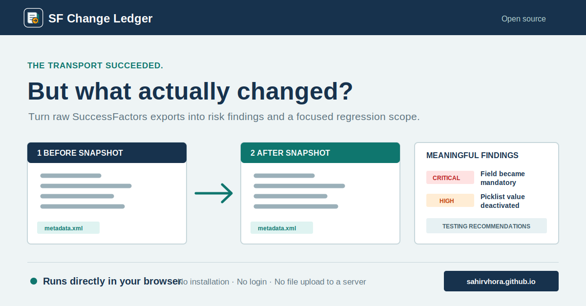

# SF Change Ledger

[](https://github.com/SahirVhora/sf-change-ledger/actions/workflows/ci.yml)
[](https://sahirvhora.github.io/sf-change-ledger/)
[](https://www.python.org/)
[](LICENSE)

Semantic version control for SAP SuccessFactors configuration exports.



SF Change Ledger turns raw SuccessFactors metadata and picklist exports into a
consultant-readable change pack: what changed, why it matters, what should be
tested, and what can go into a CAB or configuration review pack.

## MVP Scope

The first version is intentionally local-first:

- Parse OData `$metadata` XML files.
- Parse picklist exports from JSON or CSV.
- Normalise noisy exports into stable configuration objects.
- Diff two snapshots by stable object ID.
- Score risk from meaningful SuccessFactors changes.
- Generate Markdown, HTML, Excel, or JSON reports.

Future parsers can add business rules, workflows, RBP exports, and MDF XML
without changing the reporting pipeline.

See [ARCHITECTURE.md](ARCHITECTURE.md) for the processing model and parser
extension plan.

**Public site:** https://sahirvhora.github.io/sf-change-ledger/

The public site is the complete browser application. Users can select Before
and After exports, review findings, and download reports without installing
Python or running a server. Processing stays in the browser.

## Quick Start

For most users, open the browser application:

**https://sahirvhora.github.io/sf-change-ledger/**

Select the Before and After files and click **Generate comparison**. Nothing is
installed or uploaded to a server.

For CLI use:

```bash
python3 -m sf_change_ledger compare \
  --left samples/before \
  --right samples/after \
  --out reports/sample-change-pack.md

python3 -m sf_change_ledger compare \
  --left samples/before \
  --right samples/after \
  --out reports/sample-change-pack.html

python3 -m sf_change_ledger compare \
  --left samples/before \
  --right samples/after \
  --out reports/sample-change-pack.xlsx
```

## Web UI

### Browser version

Open https://sahirvhora.github.io/sf-change-ledger/ and use the application
directly. No installation, terminal, login, or tenant connection is required.

### Local Flask version

```bash
pip install -r requirements-web.txt
PYTHONPATH=src python3 web/app.py
```

Open `http://127.0.0.1:5075`, select the Before and After exports, and generate
the comparison. The results screen provides Excel, HTML, Markdown, and JSON
downloads.

## Snapshot Layout

A snapshot is a folder containing one or more supported export files:

```text
snapshot/
  metadata.xml
  picklists.json
  picklists.csv
```

Only files that exist are parsed. The tool is safe to run on incomplete
snapshots.

## Output

The report includes:

- executive summary
- change count by object type
- high-risk changes
- testing checklist
- detailed property-level diffs

## Development

```bash
pytest -q
python3 -m sf_change_ledger compare --left samples/before --right samples/after --out reports/demo.md
```

## Data Safety

The tool is designed for local exported configuration files. Do not place
tenant credentials, employee data, or sensitive client exports in git.
